# Natural Language Banking System - Architecture Diagram

```mermaid
graph TB
    subgraph "Client Layer"
        CLIENT[Client Applications<br/>Mobile/Web/API]
    end

    subgraph "API Gateway Layer"
        EXPRESS[Express.js Server<br/>Port 3000]
        SWAGGER[Swagger UI<br/>/api-docs]
        MIDDLEWARE[Middleware<br/>- JSON Parser<br/>- Error Handler<br/>- Phone Auth]
    end

    subgraph "Route Layer"
        ROUTES[API Routes]
        CHAT[Chat Routes<br/>/api/chat]
        QUERY[Query AI<br/>/api/query-ai]
        TRANSFER[Transfer<br/>/api/transfer]
        AIRTIME[Buy Airtime<br/>/api/buy-airtime]
        INTERNAL[Internal Transfer<br/>/api/internal-transfer]
        ACCOUNT[Account Mgmt<br/>/api/create-account<br/>/api/list-accounts<br/>/api/balance]
        VERIFY[Verify Transaction<br/>/api/verify-transaction]
        REGISTER[Register<br/>/api/register-account]
        PIN[PIN Management<br/>/api/set-pin<br/>/api/verify-pin]
        LOAD[Load Money<br/>/api/load-money]
        USERS[User Management<br/>/api/users]
        BANK_VERIFY[Account Verification<br/>/api/account-verification]
    end

    subgraph "Service Layer"
        SERVICES[Core Services]
        DB_SERVICE[(Database Service<br/>Prisma ORM)]
        LLM_SERVICE[LLM Service<br/>Gemini/Claude]
        BANK_SERVICE[Bank Verification<br/>Paystack Integration]
        EBILLS_SERVICE[eBills Service<br/>Airtime/Data]
        PENDING_SERVICE[Pending Transactions<br/>In-Memory Store]
        CONV_SERVICE[Conversation Manager<br/>Chat History]
    end

    subgraph "Database Layer"
        POSTGRES[(PostgreSQL Database)]
        CUSTOMERS[(Customers Table)]
        ACCOUNTS[(Accounts Table)]
        TRANSACTIONS[(Transactions Table)]
        BENEFICIARIES[(Beneficiaries Table)]
        BILL_PAYMENTS[(Bill Payments Table)]
        DOCUMENTS[(Documents Table)]
        ACCOUNT_HISTORY[(Account History Table)]
    end

    subgraph "External Services"
        PAYSTACK[Paystack API<br/>Account Verification]
        EBILLS_API[eBills API<br/>Airtime Purchase]
        GEMINI[Google Gemini AI<br/>Natural Language]
        CLAUDE[Anthropic Claude AI<br/>Natural Language]
    end

    subgraph "Data Files"
        BANKS_JSON[data/nigerian-banks.json<br/>223 Nigerian Banks]
    end

    %% Client to API Gateway
    CLIENT -->|HTTP/HTTPS Requests| EXPRESS
    EXPRESS --> MIDDLEWARE
    MIDDLEWARE --> SWAGGER
    MIDDLEWARE --> ROUTES

    %% Routes
    ROUTES --> CHAT
    ROUTES --> QUERY
    ROUTES --> TRANSFER
    ROUTES --> AIRTIME
    ROUTES --> INTERNAL
    ROUTES --> ACCOUNT
    ROUTES --> VERIFY
    ROUTES --> REGISTER
    ROUTES --> PIN
    ROUTES --> LOAD
    ROUTES --> USERS
    ROUTES --> BANK_VERIFY

    %% Routes to Services
    CHAT --> CONV_SERVICE
    QUERY --> LLM_SERVICE
    TRANSFER --> DB_SERVICE
    TRANSFER --> PENDING_SERVICE
    TRANSFER --> LLM_SERVICE
    AIRTIME --> EBILLS_SERVICE
    AIRTIME --> PENDING_SERVICE
    AIRTIME --> LLM_SERVICE
    INTERNAL --> DB_SERVICE
    INTERNAL --> PENDING_SERVICE
    INTERNAL --> LLM_SERVICE
    ACCOUNT --> DB_SERVICE
    VERIFY --> DB_SERVICE
    VERIFY --> EBILLS_SERVICE
    VERIFY --> PENDING_SERVICE
    REGISTER --> DB_SERVICE
    PIN --> DB_SERVICE
    LOAD --> DB_SERVICE
    USERS --> DB_SERVICE
    BANK_VERIFY --> BANK_SERVICE

    %% Services to Database
    DB_SERVICE --> POSTGRES
    POSTGRES --> CUSTOMERS
    POSTGRES --> ACCOUNTS
    POSTGRES --> TRANSACTIONS
    POSTGRES --> BENEFICIARIES
    POSTGRES --> BILL_PAYMENTS
    POSTGRES --> DOCUMENTS
    POSTGRES --> ACCOUNT_HISTORY

    %% Services to External APIs
    BANK_SERVICE --> PAYSTACK
    BANK_SERVICE --> BANKS_JSON
    EBILLS_SERVICE --> EBILLS_API
    LLM_SERVICE --> GEMINI
    LLM_SERVICE --> CLAUDE

    %% Service Dependencies
    CONV_SERVICE --> DB_SERVICE
    PENDING_SERVICE -.->|In-Memory| PENDING_SERVICE

    %% Styling
    classDef clientLayer fill:#e1f5ff,stroke:#01579b,stroke-width:2px
    classDef apiLayer fill:#f3e5f5,stroke:#4a148c,stroke-width:2px
    classDef routeLayer fill:#e8f5e9,stroke:#1b5e20,stroke-width:2px
    classDef serviceLayer fill:#fff3e0,stroke:#e65100,stroke-width:2px
    classDef dbLayer fill:#fce4ec,stroke:#880e4f,stroke-width:2px
    classDef externalLayer fill:#fff9c4,stroke:#f57f17,stroke-width:2px
    classDef dataLayer fill:#e0f2f1,stroke:#004d40,stroke-width:2px

    class CLIENT clientLayer
    class EXPRESS,SWAGGER,MIDDLEWARE apiLayer
    class ROUTES,CHAT,QUERY,TRANSFER,AIRTIME,INTERNAL,ACCOUNT,VERIFY,REGISTER,PIN,LOAD,USERS,BANK_VERIFY routeLayer
    class SERVICES,DB_SERVICE,LLM_SERVICE,BANK_SERVICE,EBILLS_SERVICE,PENDING_SERVICE,CONV_SERVICE serviceLayer
    class POSTGRES,CUSTOMERS,ACCOUNTS,TRANSACTIONS,BENEFICIARIES,BILL_PAYMENTS,DOCUMENTS,ACCOUNT_HISTORY dbLayer
    class PAYSTACK,EBILLS_API,GEMINI,CLAUDE externalLayer
    class BANKS_JSON dataLayer
```

## System Architecture Overview

### 1. **Client Layer**
- External applications (Mobile, Web, API clients) making HTTP/HTTPS requests

### 2. **API Gateway Layer**
- **Express.js Server**: Main HTTP server on port 3000
- **Swagger UI**: Interactive API documentation at `/api-docs`
- **Middleware**: Request parsing, authentication, error handling

### 3. **Route Layer** (12 Route Modules)
- **Chat**: Legacy chat functionality
- **Query AI**: Natural language queries
- **Transfer**: Money transfers with NLP
- **Buy Airtime**: Airtime purchase with NLP
- **Internal Transfer**: Transfer between own accounts
- **Account Management**: Create/list accounts, get balance
- **Verify Transaction**: PIN verification for pending transactions
- **Register**: New customer registration
- **PIN Management**: Set/verify PIN
- **Load Money**: Credit customer account
- **User Management**: Get users, validate phone numbers
- **Account Verification**: Verify bank account numbers

### 4. **Service Layer** (6 Core Services)
- **Database Service**: Prisma ORM for all database operations
- **LLM Service**: Integration with Gemini/Claude for NLP
- **Bank Verification**: Paystack integration for account verification
- **eBills Service**: Airtime/data purchase integration
- **Pending Transactions**: In-memory store for transactions awaiting PIN
- **Conversation Manager**: Chat history management

### 5. **Database Layer** (PostgreSQL)
- **Customers**: Customer information
- **Accounts**: Multiple accounts per customer
- **Transactions**: All financial transactions
- **Beneficiaries**: Saved recipients
- **Bill Payments**: Airtime, data, utilities
- **Documents**: Customer documents
- **Account History**: Failed transaction tracking

### 6. **External Services**
- **Paystack**: Bank account verification API
- **eBills API**: Airtime/data purchase API
- **Google Gemini**: AI for natural language processing
- **Anthropic Claude**: Alternative AI provider

### 7. **Data Files**
- **nigerian-banks.json**: 223 Nigerian banks with CBN codes

## Key Features

1. **Natural Language Processing**: All transactions can be initiated using natural language
2. **Phone-based Authentication**: Phone number used as primary authentication
3. **Multi-Account Support**: Customers can have multiple accounts
4. **Pending Transaction System**: Two-step verification with PIN
5. **External Integrations**: Paystack for verification, eBills for airtime
6. **AI-Powered**: Gemini/Claude for understanding user intent
7. **Comprehensive API**: 20+ endpoints for banking operations

## Data Flow Examples

### Transfer Flow:
1. Client → Express → Transfer Route
2. Transfer Route → LLM Service (parse intent)
3. Transfer Route → Database Service (find recipient)
4. Transfer Route → Bank Verification (if external account)
5. Transfer Route → Pending Transactions (store pending)
6. Client → Verify Transaction Route → Database Service (execute)

### Airtime Purchase Flow:
1. Client → Express → Buy Airtime Route
2. Buy Airtime Route → LLM Service (parse amount/phone)
3. Buy Airtime Route → Network Detector (detect network)
4. Buy Airtime Route → Database Service (check balance)
5. Buy Airtime Route → eBills Service (purchase)
6. Buy Airtime Route → Database Service (record transaction)

